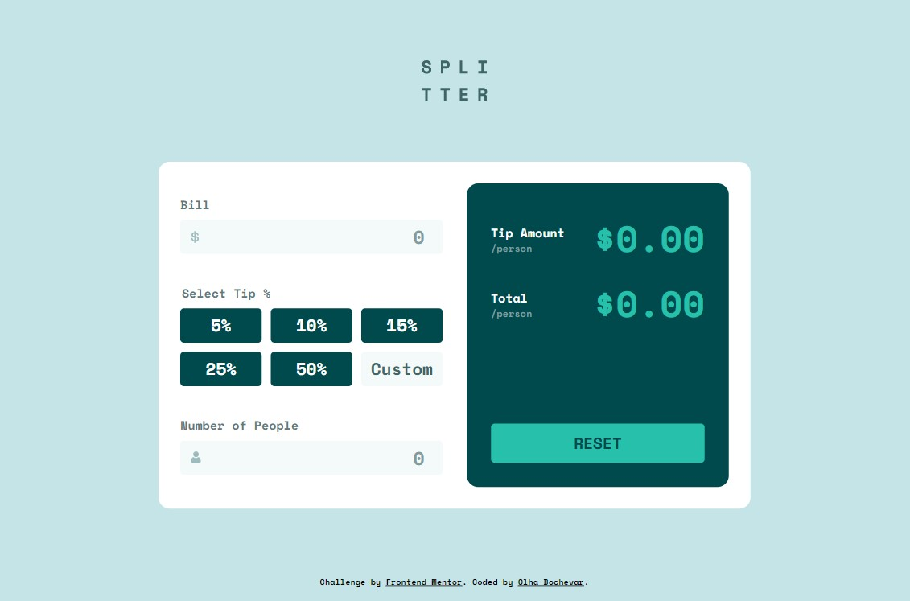

# Frontend Mentor - Tip calculator app solution

This is a solution to the [Tip calculator app challenge on Frontend Mentor](https://www.frontendmentor.io/challenges/tip-calculator-app-ugJNGbJUX).

## Table of contents

- [Overview](#overview)
  - [The challenge](#the-challenge)
  - [Screenshot](#screenshot)
  - [Links](#links)
- [My process](#my-process)
  - [Built with](#built-with)
  - [What I learned](#what-i-learned)
  - [Continued development](#continued-development)


## Overview

### The challenge

Users should be able to:

- View the optimal layout for the app depending on their device's screen size
- See hover states for all interactive elements on the page
- Calculate the correct tip and total cost of the bill per person

### Screenshot



### Links

- Solution URL: [https://github.com/olha-bochevar/tip-calculator-app-main](https://github.com/olha-bochevar/tip-calculator-app-main)
- Live Site URL: [https://olha-bochevar.github.io/tip-calculator-app-main/](https://olha-bochevar.github.io/tip-calculator-app-main/)

## My process

### Built with

- Semantic HTML5 markup
- CSS custom properties
- Flexbox
- CSS Grid

### What I learned

1) A choice of tip is realized with using radio buttons (check of state 'check' and updating UI after change tip):

```html
<fieldset>
  <legend>Select Tip %</legend>
  <div class="tips" oninput="updateUI()">
    <div class="tip">
      <input type="radio" id="val-5" name="tip" value="5" />
      <label for="val-5">5%</label>
    </div>
    <!-- the others divs -->
    <div class="tip custom">
        <input type="radio" id="val-custom" name="tip" value="custom" />
        <label for="val-custom">Custom</label>
        <input type="number" class="hidden" name="tip-custom" id="val-custom-number" value="0" />
      </div>
</fieldset>
```
CSS styles are based on using property "visibility: hidden" on input[type="radio"]
```css
.tip>input {
  width: 100%;
  height: 100%;
  visibility: hidden;
  cursor: pointer;
}

.tip>label {
  width: 100%;
  height: 100%;
  position: absolute;
  top: 0;
  left: 0;
}

.tip>input:checked+label {
  background-color: var(--primary-color);
  color: var(--very-dark-cyan);
}
```
The change of Custom input[type="radio"] to Custom input[type="number"] is realised with checking state of radio (if Custom radio checked, then we add specific classes for target elements).
```js
// change custom input 'radio' to 'number'
function hideCustomRadio() {
  if (customTip.checked) {
    customTip.classList.add("hidden");
    customTip.nextElementSibling.setAttribute("class", "hidden");
    inputCustomTip.classList.remove("hidden");
    inputCustomTip.classList.add("input-tip-custom");
  }
}
```

2) A special difficulty was incorrect null styles for inputs. After deploying app it found out there is other look of paddings and border-radius on iPhone, hovewer Chrome DevTools with correct dimension didn`t show this problem.
The problem was solved with adding the next styles for target input type:
```css
  input[type="reset"] {
    appearance: none;
    -webkit-appearance: none;
    border-radius: 0;
  }
```

### Continued development

In my opinion, it would be cool to make easy function "UpdateUI()" by splitting it into more small pieces.


